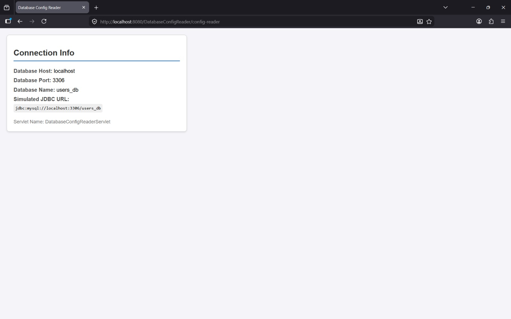
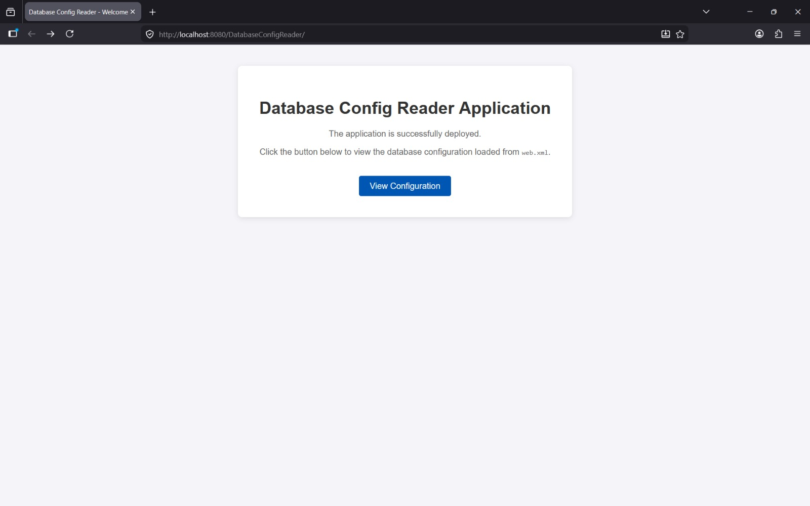

# Database Config Reader Project

## Student Details

| Field         | Details                          |
|---------------|----------------------------------|
| Name          | shaheed Kolhar                   |
| USN           | 2BL24CS418                       |
| Branch        | Computer Science & Engineering   |
| Semester      | VI Semester                      |
| Subject       | Advanced Java Programming        |
| Problem No.   | PROBLEM 44                       |

## Problem Statement

This is a Database Configuration Reader application built using Java Servlets. It demonstrates the use of `ServletConfig` to retrieve initialization parameters defined in `web.xml`. The servlet reads database details like host, port, and database name from the deployment descriptor and displays them along with a simulated JDBC URL.

## Technologies Used

- Java (Servlets)
- HTML, CSS (inline)
- Apache Tomcat 10
- Eclipse IDE

## How to Run This Project

1. Clone this repository or download the ZIP.
2. Import the project into Eclipse as a Dynamic Web Project.
3. Add Apache Tomcat as the server in Eclipse.
4. Right-click project → Run As → Run on Server.
5. Open browser and go to: http://localhost:8080/DatabaseConfigReader/index.html

## Screenshots

### Input Form

### Output / Result Page

## Servlet Concept Practiced

This project demonstrates the use of the **ServletConfig** interface to read initialization parameters (`<init-param>`) from the `web.xml` deployment descriptor. This approach allows developers to configure servlet-specific settings (like database credentials or service endpoints) externally, making the application more flexible and easier to maintain without recompiling the source code.
